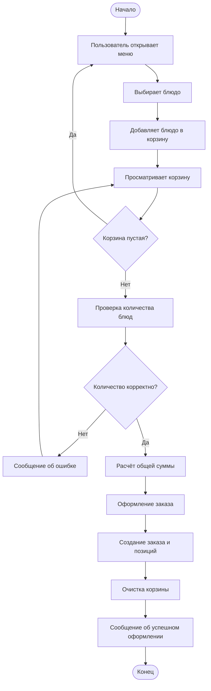

# Блок-схема оформления заказа

```mermaid
flowchart TD
    A([Начало]) --> B[Пользователь открывает меню]
    B --> C[Выбирает блюдо]
    C --> D[Добавляет блюдо в корзину]
    D --> E[Просматривает корзину]
    E --> F{Корзина пустая?}
    F -- Да --> B
    F -- Нет --> G[Проверка количества блюд]
    G --> H{Количество корректно?}
    H -- Нет --> I[Сообщение об ошибке]
    I --> E
    H -- Да --> J[Расчёт общей суммы]
    J --> K[Оформление заказа]
    K --> L[Создание заказа и позиций]
    L --> M[Очистка корзины]
    M --> N[Сообщение об успешном оформлении]
    N --> O([Конец])
```
    